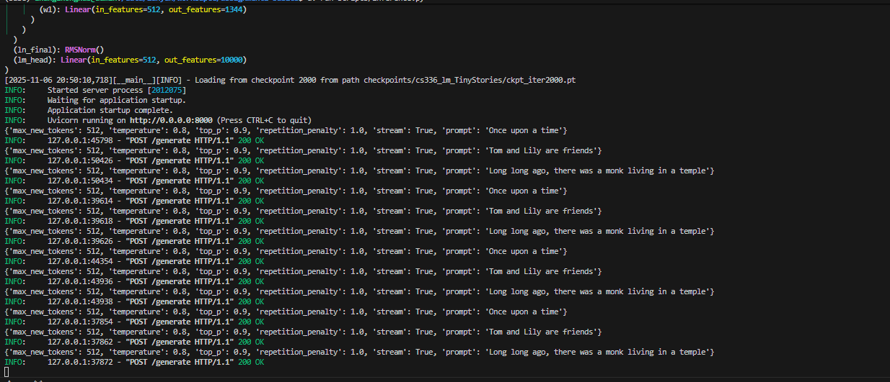
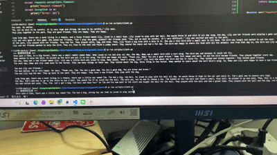

# What I Have Done
## - Implement all modules listed in tests/adapter and pass all unit tests
Most of implementation reference from following repositories, thanks to their great works:
- [clean-llm](https://github.com/wingAGI/clean-llm/tree/main)
- [LanguageModeling](https://github.com/eve-liya/LanguageModeling/tree/main)  

I implement 3 versions of BEP training, see comparsion in [here](./exps/runtime.MD)
## - Pretrain BasicTransformerLM and Qwen2_5 on TinyStories and OpenWebText
check my pretrain results in [comet panel](https://www.comet.com/leg-end/pretrain/view/new/panels)
## - NTK-aware RoPE was incorporated in [rope](./cs336_basics/RoPE.py)
by modifying parameter of context_scale in config file, you can get expanded context length without retraining.  
Some excellent blogs explaining RoPE helps me lot in understanding the mechanism:
- [Transformer升级之路：10、RoPE是一种β进制编码](https://spaces.ac.cn/archives/9675)
- [[通俗易读]无痛理解旋转位置编码RoPE](https://zhuanlan.zhihu.com/p/8306958113)
## - Further, I pack pretrained LLM as a service which can be accessed through url
check my service code in [inference.py](./scripts/inference.py)
the access code is in [client.py](./scripts/client.py)
To launch a LLM service, use following command:
```
uv run scripts/inference.py
```
Below is what it should looks like for back-end service:

To access the service, use following command (change config or prompt inside the code as your wish):
```
uv run scripts/client.py
```
Streaming output is supported once you set stream=True, then you can see a real time token-by-token output on terminal, instead of waiting for the whole output.  
Below is what it should looks like for streaming output:


# CS336 Spring 2025 Assignment 1: Basics

For a full description of the assignment, see the assignment handout at
[cs336_spring2025_assignment1_basics.pdf](./cs336_spring2025_assignment1_basics.pdf)

If you see any issues with the assignment handout or code, please feel free to
raise a GitHub issue or open a pull request with a fix.

## Setup

### Environment
We manage our environments with `uv` to ensure reproducibility, portability, and ease of use.
Install `uv` [here](https://github.com/astral-sh/uv) (recommended), or run `pip install uv`/`brew install uv`.
We recommend reading a bit about managing projects in `uv` [here](https://docs.astral.sh/uv/guides/projects/#managing-dependencies) (you will not regret it!).

You can now run any code in the repo using
```sh
uv run <python_file_path>
```
and the environment will be automatically solved and activated when necessary.

### Run unit tests


```sh
uv run pytest
```

Initially, all tests should fail with `NotImplementedError`s.
To connect your implementation to the tests, complete the
functions in [./tests/adapters.py](./tests/adapters.py).

### Download data
Download the TinyStories data and a subsample of OpenWebText

``` sh
mkdir -p data
cd data

wget https://hf-mirror.com/datasets/roneneldan/TinyStories/resolve/main/TinyStoriesV2-GPT4-train.txt
wget https://hf-mirror.com/datasets/roneneldan/TinyStories/resolve/main/TinyStoriesV2-GPT4-valid.txt

wget https://hf-mirror.com/datasets/stanford-cs336/owt-sample/resolve/main/owt_train.txt.gz
gunzip owt_train.txt.gz
wget https://hf-mirror.com/datasets/stanford-cs336/owt-sample/resolve/main/owt_valid.txt.gz
gunzip owt_valid.txt.gz

cd ..
```

